# Unsupervised Representation Learning with Joint Embedding Predictive Architectures (JEPA) on Minecraft

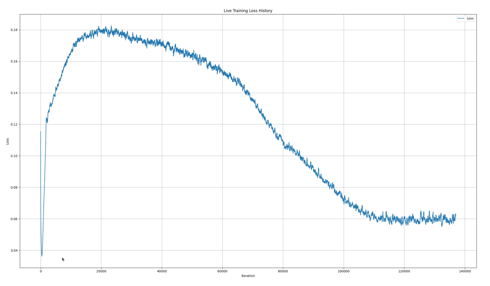

This repository contains research and implementation code for training a **Joint Embedding Predictive Architecture (JEPA)** to learn high-level semantic representations of Minecraft video data without pixel-level supervision. As a 19-year-old student, I designed and conducted these experiments individually as a hands-on project to learn, practice, and explore self-supervised representation learning. To enforce spatial awareness and allow reconstruction tasks, the architecture utilizes **2D Rotary Position Embeddings (RoPE)**. All training runs were conducted on a single **NVIDIA RTX Pro 6000 Blackwell (96GB)** GPU in native `bfloat16` precision. This project investigates the representation capacities of JEPAs, evaluates semantic vs. spatial encoding, and implements techniques to analyze and decode the learned features.

---

## Executive Summary & Experimental Log

### 1. Phase 1: Training the JEPA Encoder and Predictor
The objective of this phase was to train a JEPA model (consisting of an Encoder and a Predictor) on raw Minecraft video frames. The target is a set of masked patches, and the encoder only receives the context (everything *not* masked). A teacher model, updated via Exponential Moving Average (EMA), produces the target representations to prevent representation collapse. To preserve spatial relationships and enable downstream reconstruction, the model leverages **2D Rotary Position Embeddings (RoPE)**. The training was completed using native `bfloat16` precision on an **NVIDIA RTX Pro 6000 Blackwell (96GB)**.

#### First Training Run (Baseline)
In the first attempt, the loss decreased initially but quickly diverged. 
JEPAs are notoriously sensitive to hyperparameter scaling during early training. When the teacher model (EMA) starts updating, the complexity of the representations increases, causing a temporary spike in the loss before synchronization.
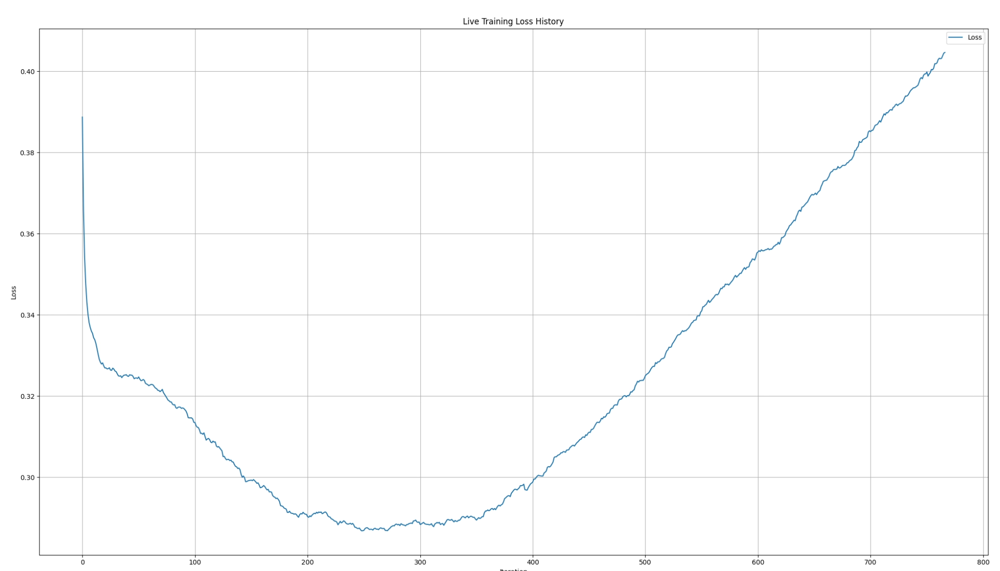

#### Second Training Run (Layer Normalization & Stable Optimization)
To stabilize training, **Layer Normalization** was introduced into the Transformer architecture. This successfully mitigated gradient explosion and divergence:
- **At 250 batches:** The loss curve demonstrated a clean downward trajectory.
- **At 1700 batches:** The characteristic JEPA loss expansion occurred as the student and teacher models synchronized, but optimization remained stable.
- **At 14000 batches:** The loss stabilized and converged linearly to `~0.18` (MSE).

| Early Training (250 Batches) | Mid Training (1700 Batches) | Convergence (14000 Batches) |
|:---:|:---:|:---:|
| 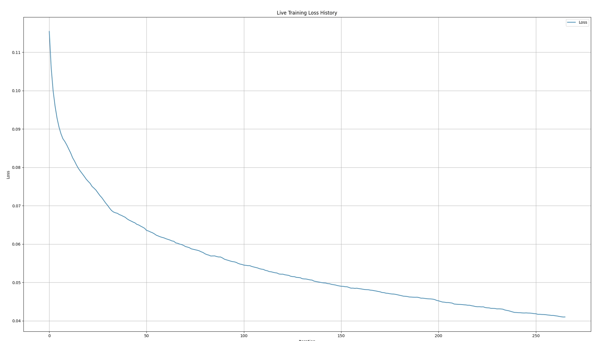 | 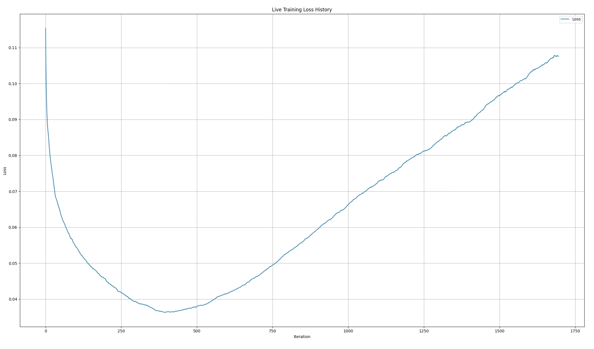 | 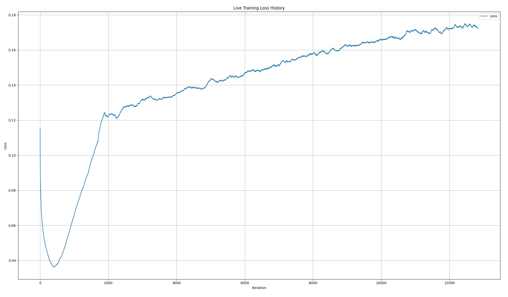 |

> [!NOTE]
> **JEPA Loss Dynamics:** The loss profile of JEPA models typically exhibits a "bell" shape. The model first learns the low-frequency background distribution of the data (loss drops), then the EMA teacher catch-up phase forces the embeddings to represent complex semantic features (loss rises as target complexity increases), and finally, both networks synchronize, leading to convergence.

---

### 2. Phase 2: Unsupervised Semantic Segmentation
To verify if the frozen JEPA encoder learned semantically meaningful features, I applied **Principal Component Analysis (PCA)** to reduce the 768-dimensional embeddings to 3 dimensions (representing RGB channels).

Even without any pixel reconstruction or semantic label supervision, the model successfully learned to segment Minecraft frames:
- **Grass** is mapped to purple/pink.
- The **Shield** is mapped to blue.
- The **Sky** is mapped to green.

This demonstrates that JEPA naturally organizes features along semantic boundaries.
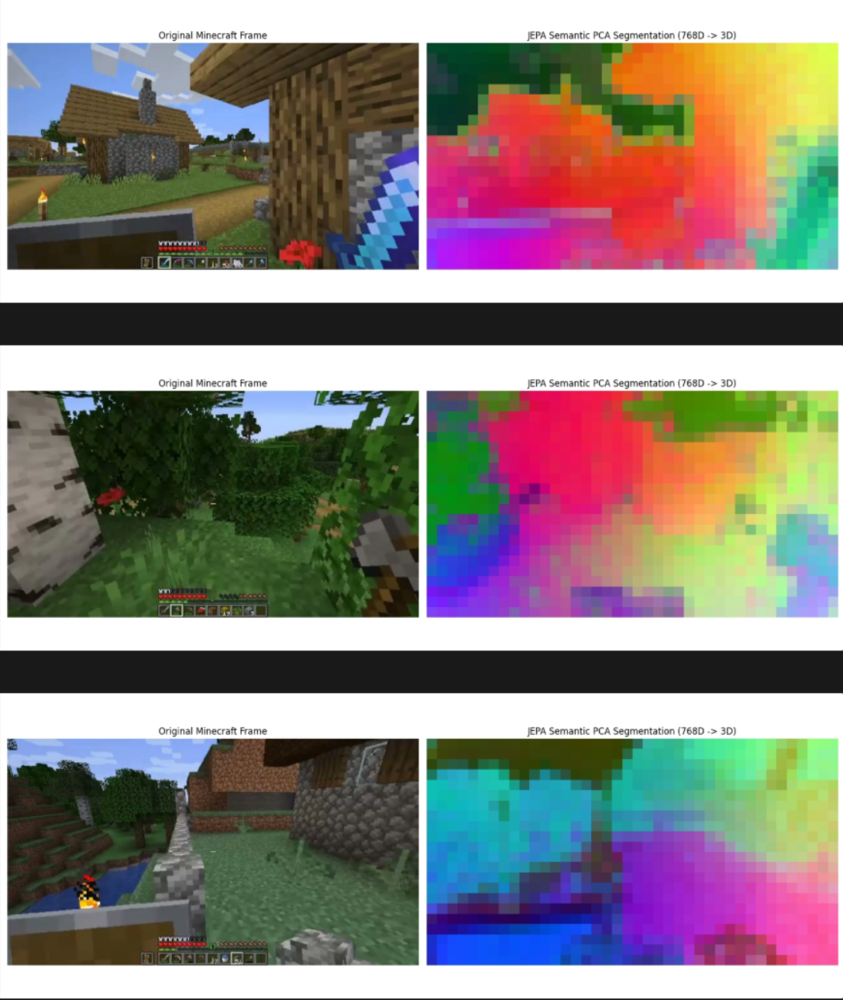

---

### 3. Phase 3: Pixel Reconstruction & The Cheating Decoder Hypothesis

#### Linear Autoencoder Projection
To improve visualization quality beyond PCA, I trained a single linear layer (Linear Decoder) to compress the representations into a 3-channel bottleneck, showing cleaner and more complete semantic maps.
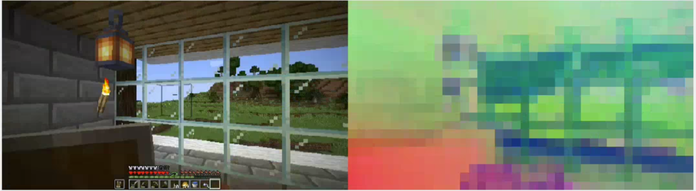
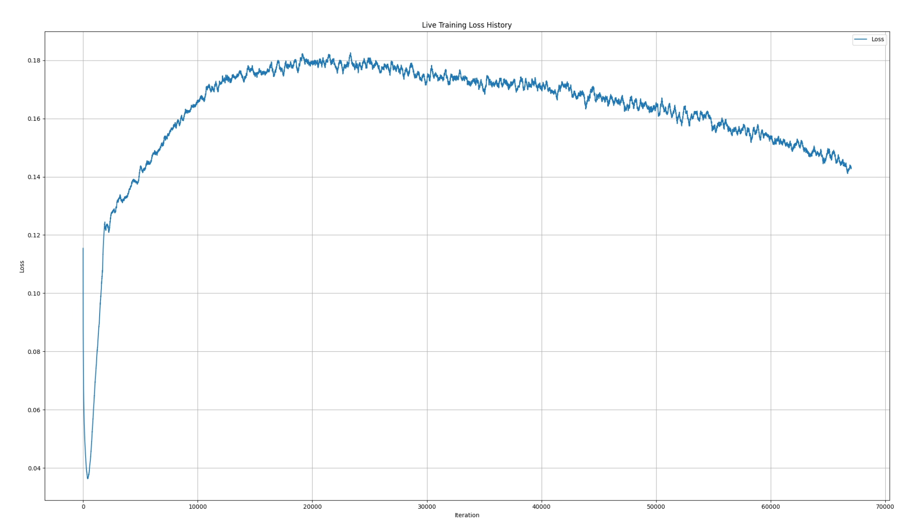

#### The Mathematical Leakage Hypothesis
When training a pixel decoder on frozen encoder outputs to reconstruct the original frames, the reconstruction was surprisingly detailed and pixel-perfect. Since the encoder is frozen and only encodes abstract semantics, a simple linear decoder should not be able to reconstruct high-fidelity textures.
- **Hypothesis:** *Mathematical Leakage (Cheating Decoder)*. Since the patch projection in the ViT encoder is a linear convolutional layer and the decoder is also linear, the decoder is able to recover raw pixel details directly from the residual stream of the representations, bypass the semantic bottleneck, and "cheat" by using low-level features.
- **Test:** I used the JEPA Predictor to hallucinate the center of the screen based *only* on the surroundings, and passed the predicted embeddings to the decoder. Since the predictor has never seen the pixels in the masked center, there is no possible residual leak from those patches.

#### Test Results
When decoding the predictor's outputs using the baseline decoder, it had a very difficult time reconstructing the details, confirming that the decoder was indeed relying on residual leakage. However, it still succeeded in predicting rough colors and generating the HUD/inventory structure, demonstrating that semantic predicting was working.
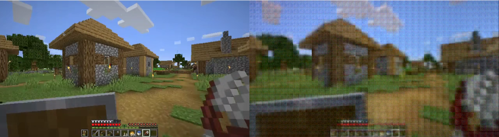

| Predictor Decoding Attempt 1 | Predictor Decoding Attempt 2 | Predictor Decoding Attempt 3 |
|:---:|:---:|:---:|
| 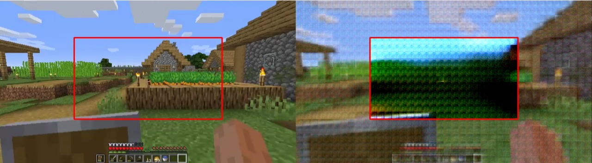 | 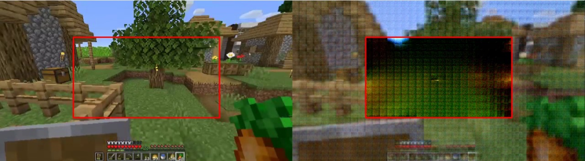 | 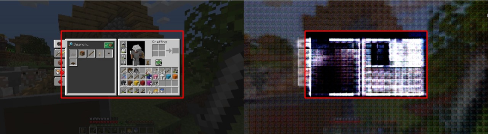 |

---

### 4. Phase 4: Isolating Semantics (The True Semantic Decoder)
To solve the residual leak, I trained the **True Semantic Decoder** strictly on predictor hallucinations (where target patches are masked out). Because the model cannot cheat on masked areas, the decoder was forced to reconstruct images using only the semantic representations.

#### Results:
The True Semantic Decoder successfully eliminated texture-level copying while retaining structural projections and object layouts. It also decoded the base encoder vectors correctly without having been trained on them, demonstrating that the semantic representation space is unified.

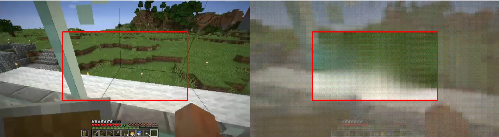
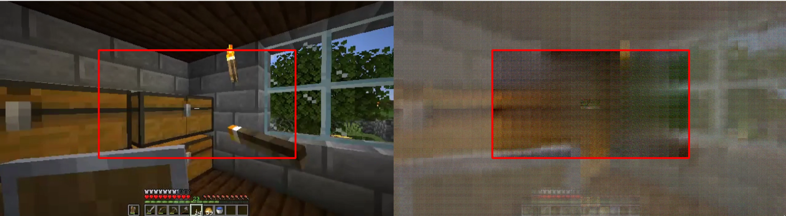
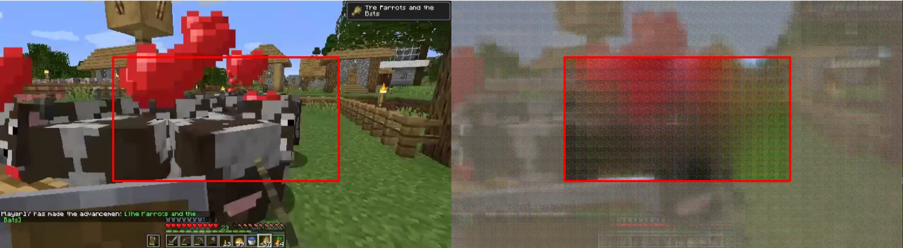
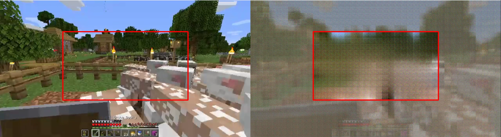

---

### 5. Phase 5: Positional Encoding and the Grid Artifact
As training progressed, the raw PCA video visualizations began to show strong, static vertical lines. Testing the linear Autoencoder produced the exact same vertical grid patterns.

#### Analysis:
The ViT encoder generates highly active **Positional Encodings** to keep track of patch coordinates. Because these spatial coordinates have extremely high variance, they dominate the principal components, hiding the actual semantic features under static vertical lines.

| PCA Positional Artifact | Autoencoder Positional Artifact |
|:---:|:---:|
| 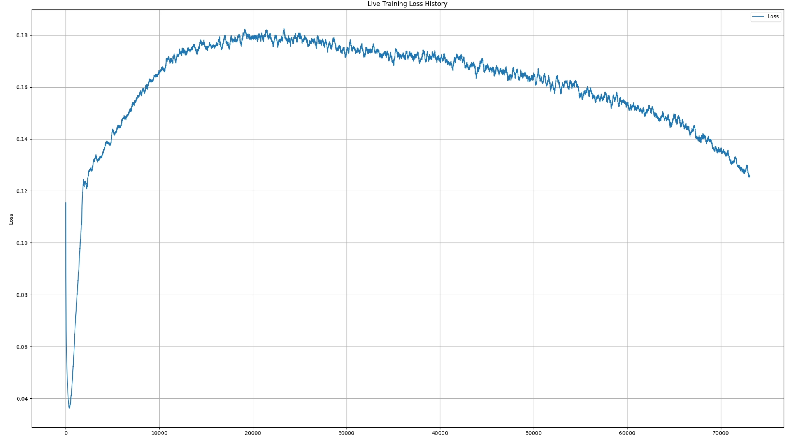 | 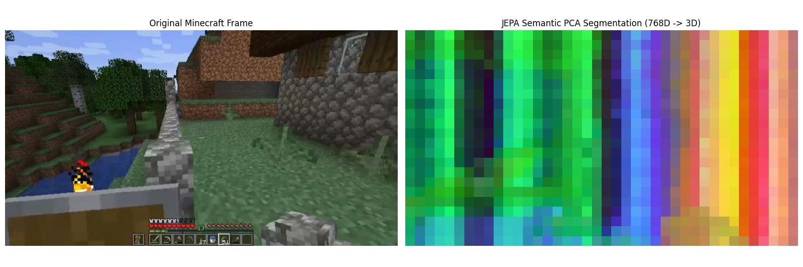 |

#### Solution: Per-Patch Mean Removal
To isolate the dynamic semantic signal, I implemented a temporal normalization heuristic: I computed the mean embedding vector for each specific patch grid coordinate across a sample of frames and subtracted it from the live features.

$$\tilde{z}_{h,w,t} = z_{h,w,t} - \frac{1}{T}\sum_{i=1}^{T} z_{h,w,i}$$

This successfully filtered out the static positional encodings and made object movements much clearer. However, a side effect is that static scenes lose variance, making objects hard to identify when there is no camera motion.

| Mean Removal Comparison 1 | Mean Removal Comparison 2 | Mean Removal Comparison 3 |
|:---:|:---:|:---:|
| 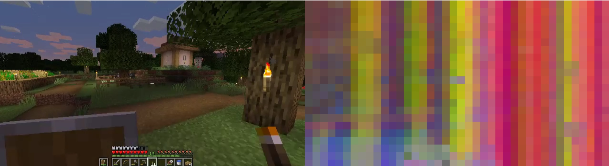 | 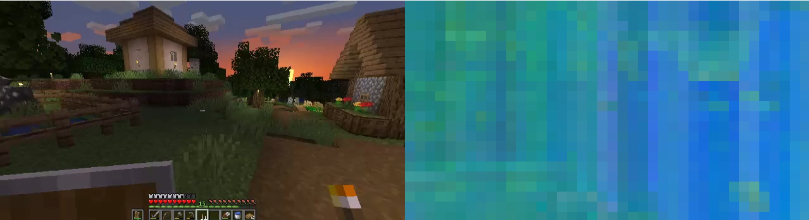 | 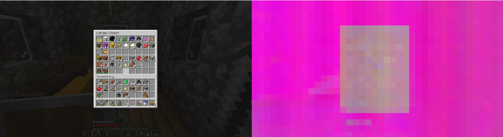 |

---

### 6. Phase 6: Dataset Correlation & Overfitting
In the final stages, I noticed that when the player opened their inventory, the decoded output shifted color completely (a global tint shift). 

Since the training dataset was composed of continuous gameplay videos at 20fps, successive frames were highly correlated. The encoder overfit to global scene taints (distinguishing the inventory screen from the outdoor world) rather than encoding localized objects.
- **Future Work:** Train on a dataset composed of highly diverse, uncorrelated, and randomized gameplay screenshots to encourage localized feature extraction.

---

## Repository Directory Structure

```filepath
.
├── config.py                         # Global hyperparameters (batch size, image dimensions, MEAN/STD)
├── dataset.py                        # Custom PyTorch Datasets (FrameDataset, BatchedDiffusionDataset)
├── model.py                          # Core ViT Encoder, Predictor, and RoPE2D architectures
├── utils.py                          # Rotary embedding math, EMA weights updater
│
├── train_jepa.py                     # Main training script (Modified: strictly predictive target loss)
│
├── decode_linear.py                  # Trains/plays a linear pixel decoder on frozen embeddings (cheating baseline)
├── decode_mlp.py                     # Trains/plays a 3-layer MLP pixel decoder on frozen embeddings
├── decode_bottleneck_ae.py           # Trains/plays a 768D -> 3D -> 768D embedding autoencoder
├── predict_center_cheating.py        # Hallucinates center patch using predictor & the cheating decoder
├── decode_semantic.py                # Trains/plays the True Semantic Decoder strictly on predictor outputs
├── export_reconstruction.py          # Runs semantic hallucination and exports stacked video to export.mp4
│
├── visualize_pca_frame.py            # Extracts semantic PCA from a single frame (discards positional encoding components 0 & 1)
├── visualize_pca_video.py            # Real-time PCA projection video visualizer
├── visualize_pca_mean_removal.py    # Real-time PCA video visualizer with per-patch mean removal
│
├── loss_plotter.py                   # Live matplotlib line chart tracking of loss_history.txt
├── loss_history.txt                  # Appended loss values recorded during training
├── images/                           # Extracted graphs and visualization figures from PDF report
│   ├── *.png                         # Includes loss_final.png (Full 137k batches training curve)
│   └── ...
│
├── encoder_latest.pt                 # Saved weights for the JEPA Encoder
├── predictor_latest.pt               # Saved weights for the JEPA Predictor
├── decoder_latest.pt                 # Saved weights for the Linear Decoder
├── advanced_decoder_latest.pt        # Saved weights for the MLP Decoder
├── embedding_ae_latest.pt            # Saved weights for the Bottleneck Autoencoder
└── true_semantic_decoder.pt          # Saved weights for the True Semantic Decoder
```

---

## How to Run the Code

### Prerequisites
Make sure you have the required packages installed:
```bash
pip install torch torchvision einops opencv-python matplotlib numpy tqdm pandas pillow
```

### 1. Training the JEPA
To start or resume training the JEPA encoder and predictor on your frames:
```bash
python3 train_jepa.py
```
*Make sure your raw JPEG frames are located in `../dataset/frames`.*

### 2. Plotting the Loss Live
To view a live updating chart of the training loss:
```bash
python3 loss_plotter.py
```

### 3. Visualizations (PCA & Encodings)
- Run PCA on a single image frame (ignoring the positional encoding components 0 and 1):
  ```bash
  python3 visualize_pca_frame.py
  ```
- Run real-time PCA visualization on a video (`video.mp4`):
  ```bash
  python3 visualize_pca_video.py
  ```
- Run real-time PCA with **per-patch mean removal** (removing vertical grid lines):
  ```bash
  python3 visualize_pca_mean_removal.py
  ```

### 4. Pixel Decoders (Linear & Semantic)
- Train and play the **linear decoder** (cheating baseline):
  ```bash
  python3 decode_linear.py
  ```
- Train and play the **MLP decoder**:
  ```bash
  python3 decode_mlp.py
  ```
- Train and play the **3-channel bottleneck Autoencoder**:
  ```bash
  python3 decode_bottleneck_ae.py
  ```
- Run center hallucination decoded with the **cheating decoder**:
  ```bash
  python3 predict_center_cheating.py
  ```
- Train and play the **True Semantic Decoder** (trained only on predictor outputs to isolate semantics):
  ```bash
  python3 decode_semantic.py
  ```
- Export the semantic reconstruction video to file:
  ```bash
  python3 export_reconstruction.py
  ```
